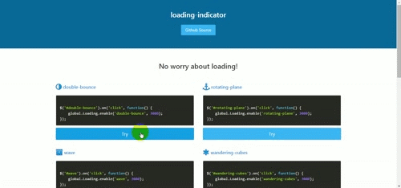
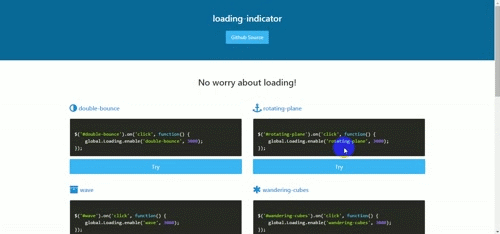
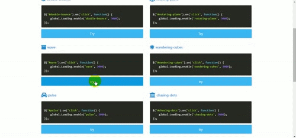
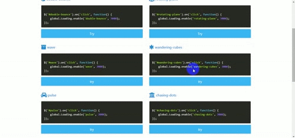
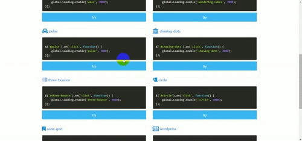
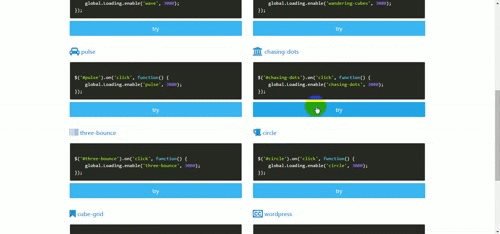

# loading-indicator  #
=================

A simple loading indicator, and it is inspired by [tobiasahlin](https://github.com/tobiasahlin)'s [SpinKit](https://github.com/tobiasahlin/SpinKit).

> It's not splash-screen. So do not use it before `body` get initialized.









## Install ##

```powershell
bower install --save loading-indicator
```

## Usage ##

```html
<html>
    <head>
        ...
        ...
        <link rel="stylesheet" type="text/css" href="path/loading-indicator/dist/loading.css">
    </head>
    <body>
        
        ...
        ...
        <script type="text/javascript" src="path/loading-indicator/dist/loading.min.js"></script>
    </body>
</html>

```

```javascript
$('#double-bounce').on('click', function() {
    Loading.enable('double-bounce', 3000);
});
```

## API ##

### method ###

#### Loading.enable(theme, timeout) ####

**theme**

The style of the indicator

Type: `string`  
Default: `double-bounce`  
Available values: `double-bounce`, `rotating-plane`, `wave`, `wandering-cubes`, `pulse`, `chasing-dots`, `three-bounce`, `circle`, `cube-grid`, `wordpress`, `audio-wave`, `spinning-disc`, `circular-square`

**timeout**

The timeout of the how long the indicator would be kept.

> If not set, the indicator would never be remove automatically

Type: `int`  
Default: `undefined`


#### Loading.destroy() ####

If not `timeout` set, you should call this method manually to remove the indicator

Check full featured demo here: [loading-indicator](http://leftstick.github.io/loading-indicator/)
  

## LICENSE ##

[MIT License](https://raw.githubusercontent.com/leftstick/loading-indicator/master/LICENSE)